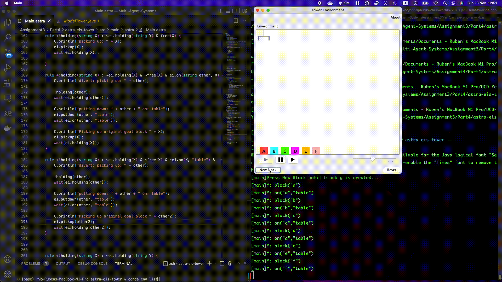

# MultiAgents

# Vacuum Robot

# astra-eis-tower

This is a minimal implementation of an Environment Interface Standard (EIS) project
that is configured for the [tower](https://github.com/eishub/tower) environment.

#Requirements

To run this project, you must install the following:

* [Maven 3.3+](http://apache.maven.org
* A Java 1.8 JDK/JRE (required due to EIS)

Simply clone the project, go to the project root folder and type `mvn` to run the
project.

## Programming Coordination with ASTRA

## Programming Agents in Environments
Goal: develop a single agent system that will control some entities residing in an environment in order to achieve some well-defined task(s).

export JAVA_HOME=`/usr/libexec/java_home -v 1.8`

# running this excersie
    mvn compile
    mvn - to run compile, and build

Parts:
- Part1: Connecting up the Environment
- Part2: Working with Blocks
- Part3: 3-block Towers
- Part4:Everythings Blockilicious!

## Introducing players with different strategies. 

To achieve this, you need to use the inheritance mechanism of ASTRA. Start by creating a new program called `LinearPlayer.astra.` This program should look as follows:

        agent LinearPlayer extends Player {
        }
Copy all the strategy rules (the +!move() rules) into the new program and delete them from Player.astra. 

Modify the Main agent to use LinearPlayer instead of Player. The game outcome should be the same.
Create another program called `Opponent.astra` and implement an alternative strategy that can beat the strategy specified in LinearPlayer.astra. Modify you Main rule to may player2 be the Opponent agent.

Finish by trying to create a` better strategy `in a file called Better.astra. 